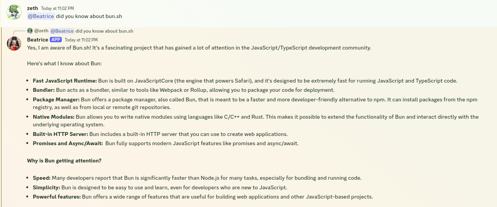
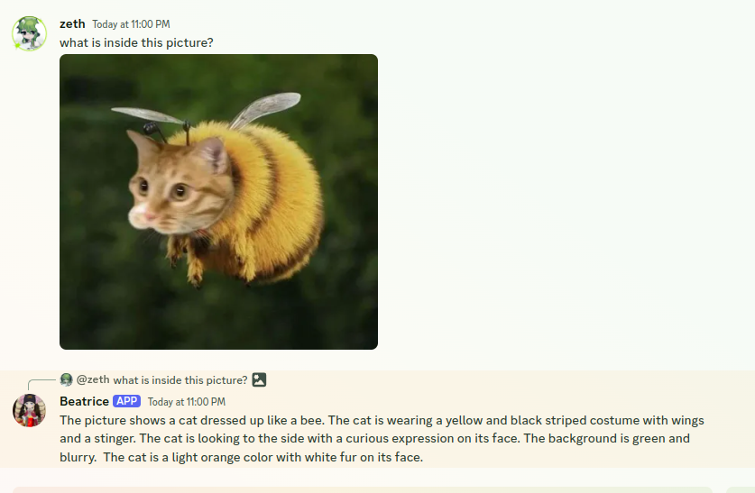

# BeatriceAI

A Discord bot that uses the Google Generative AI API to generate your answers and supporting images.

## Features

-   Generate text using the Google Generative AI API
-   Supports text and image captions
-   Supports image attachments
-   Supports editing your messages to generate new responses

## Requirements

-   [Node.js](https://nodejs.org/en/) / [Bun.sh](https://bun.sh/)
-   [Discord Bot Token](https://discord.com/developers/applications)
-   [Google API Key](https://console.developers.google.com/)
-   A bit of brain cells.

## Installation

1. Clone the repository

```bash
git clone https://github.com/Zethsue/BeatriceAI.git
```

2. Install the required packages

```bash
bun install
```

3. Edit the `.env.example` file and rename it to `.env` and fill in the required fields

```env
DISCORD_TOKEN=YOUR_DISCORD_BOT_TOKEN
GOOGLE_API_KEY=YOUR_GOOGLE_API_KEY
```

4. Run the bot

```bash
bun run index.ts
```

## Usage

To ping the bot, just type `!ping` in the chat. The bot will respond with `Pong!`.

To ask the ai bot feature, you can just ping the bot and ask the bot what you want to ask.


To ask the ai bot feature with image attachment, you can just send the image attachment and ask the bot what you want to ask.


## License

This project is licensed under the MIT License - see the [LICENSE](LICENSE) file for details
